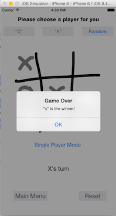

# Tic-Tac-Toe
A popular kid’s game Tic-Tac-Toe developed in Objective-C.

Two game modes: one-player and two-player.

# How To Run
Download the repository and open the .xcodeproj file in XCode. Just click on Run! 

# Screen Shots

